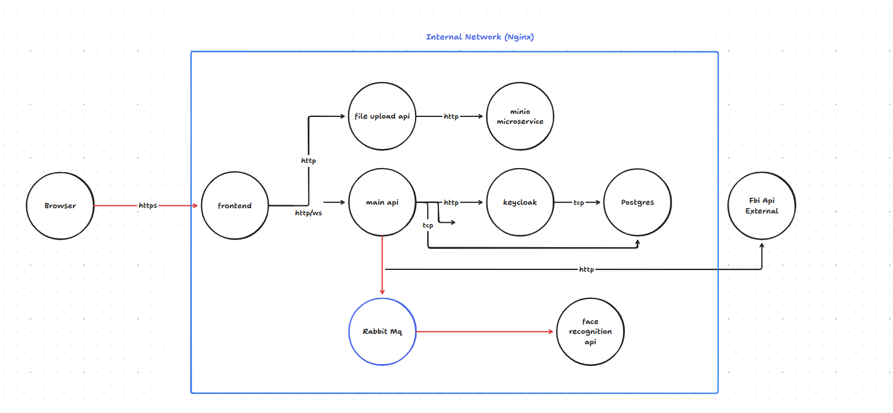

# 🕵️‍♂️ FBI - Advanced Surveillance & Face Recognition System

> **A distributed, event-driven microservices architecture for real-time tracking, reporting, and AI verification of wanted persons.**


## 🌍 Overview

The **FBI Surveillance System** is a next-generation platform designed to crowdsource intelligence on wanted individuals. It bridges the gap between public reporting and law enforcement verification using advanced AI.

When a user uploads a sighting (photo + location), the system processes the image asynchronously, compares it against a known database of vectors using Deep Learning, and broadcasts real-time alerts to all connected agents if a match is found.

## 🏗️ Architecture

The system is built on a **Microservices Architecture** using Docker containers, orchestrated via Docker Compose. It leverages an **Event-Driven** pattern using RabbitMQ to decouple heavy AI processing from the user-facing API.



### The Data Flow:
1.  **Ingestion:** User uploads a photo via **Next.js Frontend**.
2.  **Storage:** **File API** (.NET) uploads the image to **MinIO** (S3 Compatible Storage).
3.  **Messaging:** The system publishes an `AnalyzeFaceCommand` to **RabbitMQ**.
4.  **AI Analysis:** The **Python AI Service** consumes the message, downloads the image, and runs Face Recognition (DeepFace/FaceNet).
5.  **Result:** If a match is found, a result event is published back to the queue.
6.  **Notification:** The **Main Backend** processes the result and pushes a real-time alert via **SignalR** to all active dashboards.

## 🛠️ Tech Stack

### Core Services
* **Backend:** .NET 9 Web API (C#), Entity Framework Core
* **Frontend:** Next.js 15 (React), TypeScript, Tailwind CSS
* **AI Engine:** Python 3.10, DeepFace, TensorFlow, Pika (AMQP)
* **File API:** .NET 10 (Dedicated microservice for MinIO operations)

### Infrastructure & Data
* **Database:** PostgreSQL 16
* **Message Broker:** RabbitMQ
* **Object Storage:** MinIO (S3 Compatible)
* **Identity Provider:** Keycloak (OIDC/OAuth2)
* **Reverse Proxy:** Nginx (SSL Termination & Routing)
* **Containerization:** Docker & Docker Compose

## ✨ Key Features

* **🔐 Enterprise Security:** Centralized authentication via Keycloak (OpenID Connect).
* **🧠 Deep Learning Recognition:** Uses `Facenet512` model to match faces with high accuracy.
* **⚡ Real-Time Alerts:** Instant notifications using WebSockets (SignalR).
* **📂 Scalable Storage:** S3-compatible object storage for handling massive datasets.
* **📱 Responsive Dashboard:** Modern UI for tracking reports and map locations.
* **🔄 Resilience:** Automatic retries, dead-letter queues, and container auto-healing.

## 🚀 Getting Started

### Prerequisites
* Docker & Docker Compose
* Git
* A valid Domain Name (pointed to your VPS IP)

### Installation

1.  **Clone the repository**
    ```bash
    git clone [https://github.com/YourUsername/fbi-surveillance-system.git](https://github.com/YourUsername/fbi-surveillance-system.git)
    cd fbi-surveillance-system
    ```

2.  **Configure Environment Variables**
    Create a `.env` file in the root directory based on the example.
    ```bash
    cp .env.example .env
    ```
    *Edit `.env` and update the secrets and domain names.*

3.  **Configure Nginx (Reverse Proxy)**
    The system uses Nginx to handle routing and SSL.
    * Navigate to the `nginx/` directory.
    * Open `default.conf`.
    * Replace all instances of `silviu-proiect.space` (or the placeholder domain) with your actual domain name.
    * **SSL Note:** On the very first run, ensure the SSL certificates are generated via Certbot. If running for the first time without certs, you may need to temporarily comment out the SSL server block in `default.conf`.

4.  **Run the System**
    ```bash
    docker compose up -d --build
    ```

5.  **Access the Application**
    * **Frontend:** `https://your-domain.com`
    * **Keycloak:** `https://your-domain.com/auth`
    * **MinIO Console:** `https://minio.your-domain.com` (if configured)

## 🤝 Contributing

Contributions are welcome! Please follow these steps:
1.  Fork the project.
2.  Create your feature branch (`git checkout -b feature/AmazingFeature`).
3.  Commit your changes (`git commit -m 'Add some AmazingFeature'`).
4.  Push to the branch (`git push origin feature/AmazingFeature`).
5.  Open a Pull Request.

## 📝 License

Distributed under the MIT License. See `LICENSE` for more information.

---
*Built with ❤️ by [Your Name]*